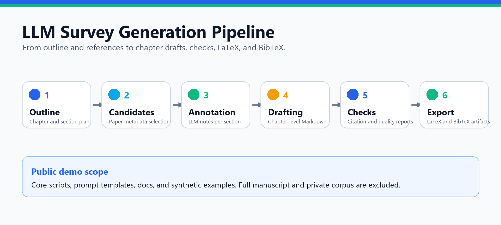

# LLM Survey Generation Pipeline



A public showcase for a reproducible long-form survey generation workflow.

## Highlights

- Structured outline to chapter-level workspace.
- Candidate paper selection and LLM annotation.
- Chapter drafting, revision, and merge stages.
- Citation coverage, deduplication, and quality checks.
- LaTeX and BibTeX export for manuscript cleanup.

## Try The Demo

```powershell
git clone https://github.com/yonger441-wq/llm-survey-generation-pipeline.git
cd llm-survey-generation-pipeline
pip install -r requirements.txt
python scripts/run_pipeline.py --dry-run
```

## Public Scope

This public version includes the core workflow, prompts, documentation, and synthetic examples. It intentionally excludes the complete private manuscript, raw paper PDFs, full paper metadata pool, and all credential-bearing files.

## Links

- [GitHub repository](https://github.com/yonger441-wq/llm-survey-generation-pipeline)
- [Pipeline documentation](pipeline.md)
- [Examples](examples.md)
- [Privacy and data notes](privacy_and_data.md)
